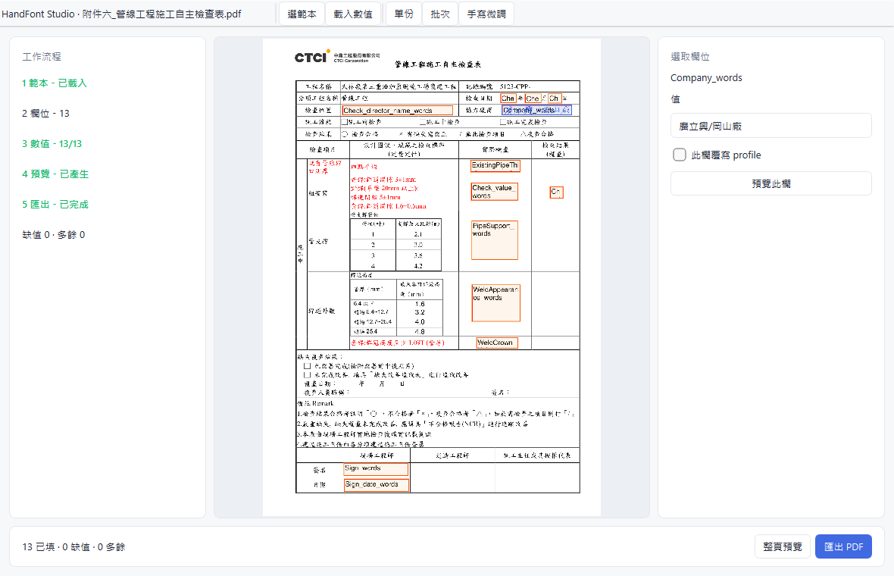
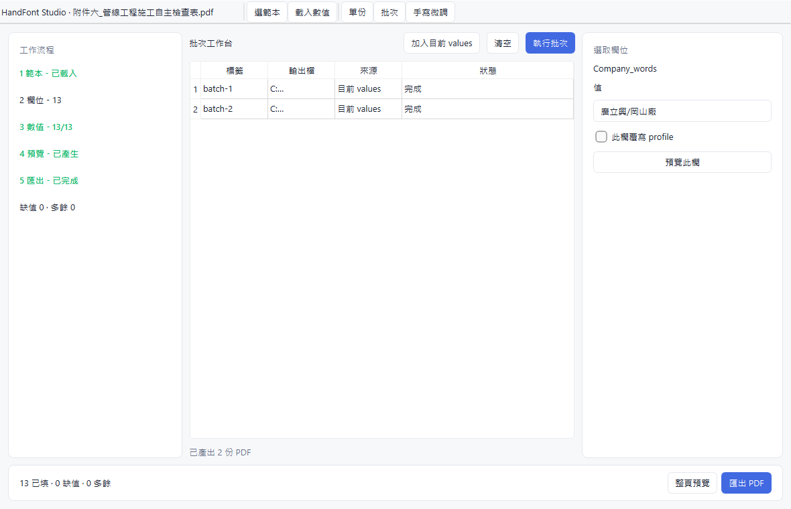

# Opus Review Brief

Date: 2026-06-16

This is the current review gate for the PySide6 rebuild of HandFont Studio.
The UI is no longer a paper mockup only: G0 through G4 are wired to the real
services and covered by smoke tests. Opus should review product direction,
interaction clarity, and architecture fit before the final cleanup phase.

## Review Target

- Main decision: whether the PySide6 workbench is the right direction for the
  next implementation pass.
- UX decision: whether the single-file flow and batch flow are understandable
  enough for repetitive signature/report cleanup work.
- Architecture decision: whether the View / ViewModel / service boundary is
  clean enough to keep the future Tauri/Web option open.

## Current Screens

Single-document workbench:



Batch workbench:



## Implemented

- `handfont-gui` launches the PySide6 workbench.
- Template loading uses `TemplateService`.
- Values loading and in-memory field edits use `ValueSetService` and
  `TemplateViewModel`.
- Full-page preview and PDF export use the same `FillDocumentService` path.
- Selected-field preview uses `RenderTextService` and overlays handwriting on
  the selected PDF field.
- Profile controls edit the active `RenderProfile` through `ProfileViewModel`.
- Batch mode adds current in-memory values as multiple jobs and runs them
  through `BatchFillService`.
- Smoke mode can generate PDF outputs and screenshots for single and batch
  flows.

## Verification

Run the full local gate:

```powershell
python -m ruff check .
python -m pytest
python -m build
```

Run the GUI smoke gate:

```powershell
$env:QT_QPA_PLATFORM = "offscreen"
handfont-gui `
  --smoke `
  --template "samples\附件六_管線工程施工自主檢查表.pdf" `
  --values samples\values_sample.json `
  --smoke-preview `
  --smoke-profile `
  --smoke-batch-dir "$env:TEMP\mrse-batch-smoke" `
  --smoke-output "$env:TEMP\mrse-gui-smoke.pdf" `
  --smoke-screenshot "$env:TEMP\mrse-gui-smoke.png"
```

Expected:

```text
GUI smoke OK fields=13 values=13 complete=True preview=True field_preview=True profile=True batch=2 screenshot=True
```

For human-readable zh-TW screenshots on Windows, use the native platform:

```powershell
$env:QT_QPA_PLATFORM = "windows"
```

Qt's offscreen platform can render CJK widget text as square boxes on this
machine. The automated smoke still validates the flow; the checked-in review
screenshots were captured with the Windows platform so the UI copy is readable.

## Ask Opus To Review

- Does the left workflow rail make the next action obvious enough?
- Is the right field inspector the correct place for value editing and
  per-field handwriting adjustments?
- Should the PDF canvas show all annotation boxes at once, or only the selected
  field plus missing-field warnings?
- Is the batch workbench sufficient for the first real repetitive-office use
  case, or should CSV/Excel row import be promoted before polish?
- Are the old Tkinter/CustomTkinter tools safe to archive after G5, or does a
  confirm/router-curation path still need migration first?

## Known Risks

- Preview/export/batch still run synchronously in the GUI thread. The worker
  wrapper exists, but it is not wired into visible operations yet.
- `fill_pdf` is still effectively single-page first. The UI leaves room for
  page navigation, but multi-page interaction is not implemented.
- Per-field profile override is represented in the UI, but the underlying
  per-field override model still needs a real data contract.
- Legacy GUI entry points are still present until the PySide6 path covers the
  remaining confirm/router workflows.

## Suggested Next Phase

If Opus approves this direction, G5 should focus on the smallest shippable
polish pass: async workers, clearer canvas overlays, missing-value affordances,
batch import from multiple JSON files, and archiving/deprecating the old GUI
entry points.
